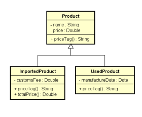
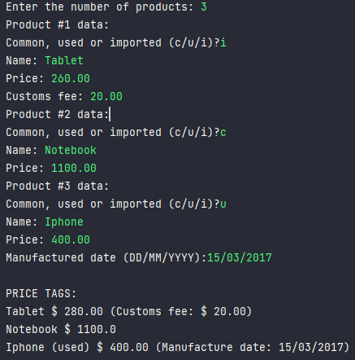

# About the project
Write a program that read data from N products.
(input from the user)
  Products have name and price. Imported products
have customs fee. Also, used products have the manufacture
date.
 All this data has to be added to a price tag.
  To the customs fee, the data has to be added to the
product final price.

### Model

### Output
